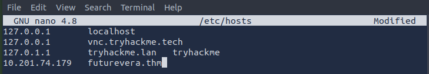
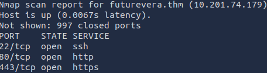
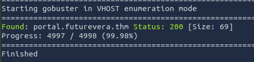
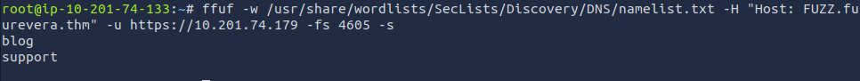
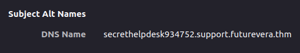

# Takeover

**Platform:** TryHackMe
**Category:** Web
**Difficulty:** Easy
**Date Completed:** 2025-08-27

---

## 1. Summary
Subdomain enumeration & finding hidden pages

## 2. Methodology
Initial information:
- Webpage link
- IP address

Setup:
- Before doing any scanning, I need to add the IP address and domain name in my /etc/hosts file, as this is not a real website.

Information gathering:
- Running a simple nmap scan, we see 3 open ports: SSH, HTTP, and HTTPS.

- Looking at the webpage, there isn't much to go off of. There are no hyperlinks, no input forms, and nothing popping out in the source code.

Enumeration:
- Running Gobuster in directory or DNS modes don't show anything of value
- When searching for virtual hosts using Gobuster, one interesting result shows up

- Despite this looking promising, the webpage gives the message 'portal.futurevera.thm is only availiable via internal VPN'
- Gobuster didn't seem to work, so I tried fuzzing it instead. This showed 2 new results that I hadn't seen before.

Discovery:
- Adding the results to /etc/hosts, I tried looking at the support page first.
- When going to the page, the server gives a 404 error. 
- Investigating further, I decided to view the certificate for this support page.
- On the certificate, you can see an alternate DNS name that looks very promising.

- Adding the page to my hosts file and viewing it in browser, the server gives a redirect message with the flag in the url.

## 3. Commands & Tools Used
- nano /etc/hosts: Used to modify my /etc/hosts so I can view webpages as they are intended in the room. I use nano for its simplicity and ease of use.
- nmap: Port scanning tool, easy to use and can give lots of valuable information. I used a basic SYN scan in this room, but there are many other types of scans and modifiers.
- Gobuster: I have found Gobuster very useful in the past for enumerating directories, hence why I tried it here. I had to use the -k flag on some commands to ignore the self-signed certificate errors.
- Ffuf: Easy to use fuzzing tool, can be used for so many purposes, but in this room I learned it works great for subdomain enumeration.

## 4. Lessons Learned
This was a great quick room for familiarizing me more with subdomain enumeration. I was unaware of how useful ffuf would be in this application, so in the future I may try using it more often. I have also learned to look at the less obvious things for information gathering, such as the certificates on a webpage. 