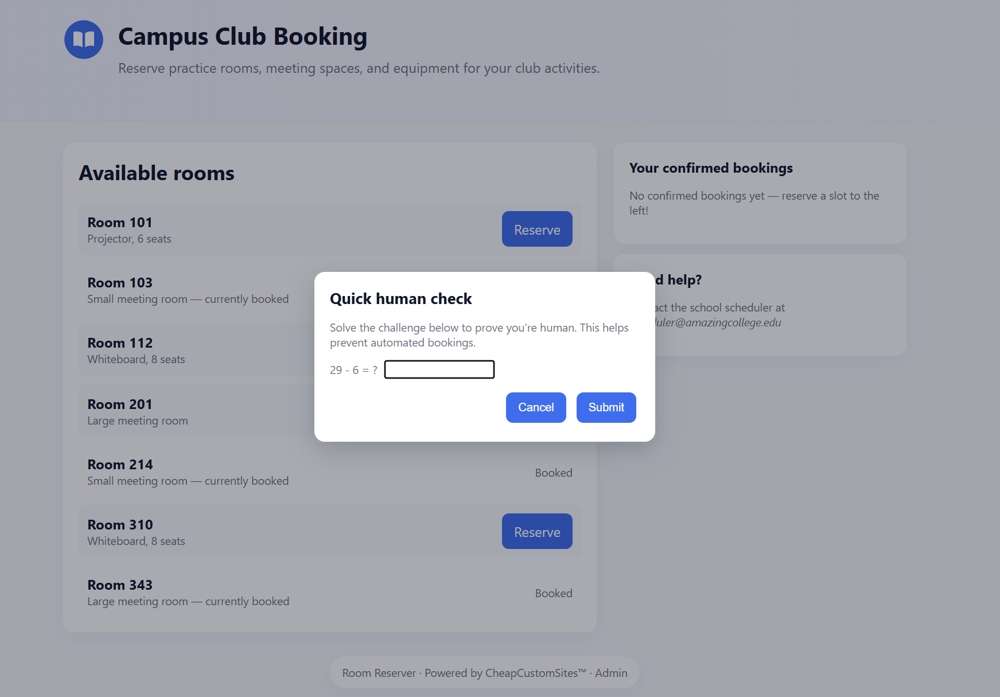

# cheap-sites

**Platform:** DAMSEC
**Category:** Web
**Difficulty:** 150 points (3 flags)
**Date Completed:** 2025-10-06

---

## 1. Summary
Web hacking CTF centered around modifying HTTP requests

## 2. Methodology
Flag 1:
- The homepage for the first flag is a room booking site with various rooms to reserve
- When I try to reserve a room, the site gives a captcha  
  
- Solving the captcha gives an alert saying `That took wayyy too long, are you AI?`, even when done quickly
- Looking at the network tab, I see an HTTP request to a URL with visible time and room parameters  
  
- I can simply copy this URL into my browser and modify the parameters, setting a time of 0.1 gives the first flag.

Flag 2:
- The next page is based on the admin portal, which has a variety of actions as well as an input field for an admin password
  
- In the given JS code, you can search for 'flag' and find the function where flag 2 is given
  
- This `getAdminPassword()` function is called any time one of the actions is ran, but none of the default actions call it with the 'email' type, the one that returns the flag
- When looking at the network after calling any action, I can see that the request has a payload with `action` and `adminPassword` parameters, as well as additional parameters specific to the action
  
- I can manually create a POST query with the parameter `"action": "getAdminPassword"`, and the server returns `Invalid Password`, the default case in the switch statement shown earlier
  
- Adding an additional parameter to the JSON, I can give it the `"type": "email"` to return the second flag

Flag 3:
- The third flag is also mentioned in the code, but this function is much harder to bypass
 
- To return the flag, the function must first have an environment different from production, and an adminPassword hard set to the 'website' version of the password
- This password is secure and I found no way to crack or bypass it, so I was stuck here for a long time
- Eventually, my teammate noticed this grantAdmin function
  
- In this function, there is an `env` variable set to `'NODE_ENV'`, and an `environment` variable which references the `env` variable and locates it in `process.env`
- `process.env` happens to be where the flags are stored, so if we can somehow hack this function we may be able to return flags
- Within the function, there is a case where the environment is different from production, and this will return a message including the `${environment}` variable
- This essentially returns `process.env['NODE_ENV']` in normal situations, but remember that the `env` variable is just a parameter taken by the function and something we can manipulate
- With this knowledge, you can make a POST request with the following JSON content: `{"action": "grantAdmin", "env": "FLAG_3"}`, which returns the third flag

## 3. Commands & Tools Used
`Developer tools`: always great for web testing  
`Thunder Client`: VSCode extension that the CTF League coordinator mentioned, great lightweight client for modifying and sending simple HTTP requests

## 4. Lessons Learned
The biggest lesson that I learned was to look at the bigger picture rather than getting tunnel visioned on one specific part. This was especially important on the third flag, where I could've gotten stuck forever looking at a secure function rather than finding the vulnerability elsewhere in the code. I'm also more comfortable looking through JS code now, and I learned how to use the Thunder Client as a way to configure HTTP requests.
