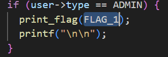
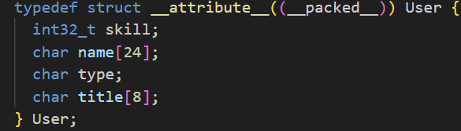
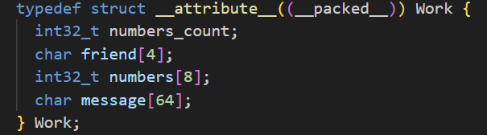

# friendly-work

**Platform:** DAMSEC    
**Category:** pwn  
**Difficulty:** 170 points (3 flags)
**Date Completed:** 2025-10-20

---

## 1. Summary
pwn challenge based on memory overflow manipulation in C

## 2. Methodology
Flag 1:  
- Flag 1 is found in the code when the user type is admin  
  
- To set the user type as admin, the code checks if your special user login is equal to the string `"strongpassword123"`
- Setting this as your login doesn't work, because the read_input function for this field only reads 16 characters
- This means we need to find a workaround
- In the User struct, the 'type' value is set after the 'name' value. Since this is a packed struct, they will be stored next to each other in memory. This means that if we can overflow the 'name' value, the overflow will write into 'type', and we can manually change our type value  
  
- The 'name' value is constructed to be only 24 characters, so we can input 24 random characters into the name field and use a 25th character to write into 'type'
- The 'ADMIN' type is set to the value 78, which corresponds to the capital N character in ASCII.
- Inputting the name field as something like `(x*24)N`, with the first 24 characters being irrelevant, sets the 'type' value to 'ADMIN' and prints the first flag

Flag 2:
- Flag 2 prints when the `work.friend` string starts with 'XP'
- There is no intended way to modify this string, so we need to mess with memory again
- Looking at the Work struct, the 'friend' value is written after the 'numbers_count' value  
  
- We cannot overflow this value, because the code checks if the numbers count is less than 8 before adding a new number
- Looking at the code for removing a number however, the case only checks if the count is greater than or equal to 0
- This means that we can have a negative numbers count, and try to access a negative element in the number array, which is conveniently set up right after the 'friend' value
- Once we are in negative numbers count by removing a few numbers, we can add a well-crafted number to overwrite the 'friend' value
- I used the python `ord()` function, which prints the decimal values corresponding to characters, multiplying each consecutive character by 256 to correspond to different bytes. For example: `print(ord('X')+ord('P')*256)` gives the value `20568`
- Adding a number with this value after going into a negative number count effectively changes the 'friend' value to 'XP', and checking on our friend prints the second flag

Flag 3:
- Flag 3 is put into the work.message when you set the message to 'flag please ... PLEASE', which we can do as intended in the program
- Trying to print the message after this however is impossible, since the print message case checks if the string starts with 'osu', which all flags in DAMSEC do
- In the Work struct shown earlier, the message string comes after the numbers array. We already determined that we can't overflow forward from this array, since we can't add any more numbers after creating 8
- After struggling with this for a while, I considered how C strings are interpreted
- Each string in C must end in a null byte in memory, meaning if you try to print something without a null byte, it will continue to print everything in memory until it hits a null byte
- This is easy to say in theory, but any time you write a string normally the null byte is automatically added
- Additionally, the message is stored after the numbers array, which is never directly printed. The closest thing in memory to the message that is printed is the 'friend' string
- Luckily, we already know how to manipulate this string, so we just have to bypass the numbers array by getting rid of all the null bytes
- The numbers are stored as 32 bit integers, meaning we can 'fill up' the memory by inputting numbers that correspond to a 4 character (4 byte) string
- Using the same `ord()` function technique from earlier, I converted the string `:)**` into the decimal number `707406138`. It must start with the smiley face to print the string, otherwise the program would say hte friend is gone.
- Adding 2 numbers with this value, we get an output of `:)**:)**`, which is a good sign because the friend value is supposed to only be 4 bytes
- After filling up every number in the numbers array with this value, checking on your friend prints a bunch of the bearded smiley faces followed by work.message, which contains flag_3 if you do the step earlier of changing the message to replace its value with flag_3

## 3. Commands & Tools Used
`VSCode`: The text editor I use to look at the C code for better readability and easier analysis  
`online-python.com`: In-browser tool to run quick Python code  
`ord()`: Builtin python function to convert ASCII characters to their decimal value (chr() is the inverse)

## 4. Lessons Learned
As my first pwn challenge, I learned a lot from this. I learned how to look for bold assumptions made in code, such as assuming an input will never exceed a certain length. This can easily leady to vulernabilities that can be exploited. I also learned a lot about memory allocation and overflow errors and their exploits. It was also my first time working this in-depth with C in general, so I'm much more comfortable reading and understanding C code now.
