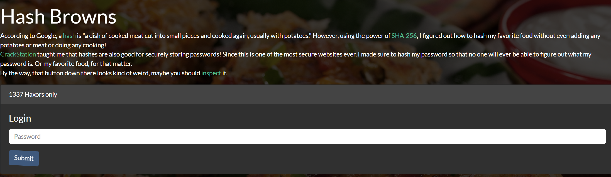
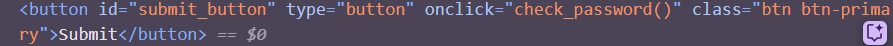
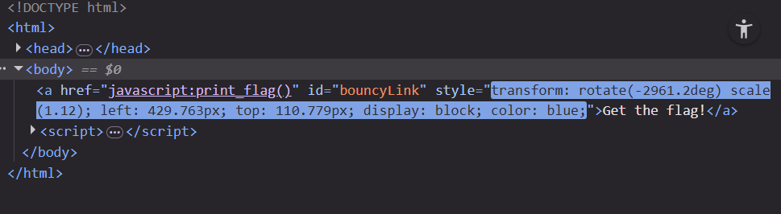

# hash-browns

**Platform:** DAMSEC 
**Category:** Web  
**Difficulty:** 50pts
**Date Completed:** 2025-09-29  

---

## 1. Summary
Introductory web hacking CTF

## 2. Methodology
Home page:  
- Right off the bat, the homepage gives some pretty clear hints for what to look for: a sha-256 hash and something to do with the submit button  
  
- Inspecting the submit button, I see that it runs a `check_password()` function on click  
  
- In the sources tab, I see that the check_password function simply compares the hashed password with a single hash string, plainly visible in the source code 
- Pasting this hash into CrackStation, I can find the password and login  

Part 2:  
- The second page gives some clickable text that bounces around the screen
  
- I tried manually clicking on it for a while, until I realized I was being dumb and could just inspect element
-   
- The text links to a `print_flag()` function, so I just manually called this function in the developer console
- After calling this function, the text changes to show the flag!

## 3. Commands & Tools Used
`Developer tools:` #1 tool for web

## 4. Lessons Learned
This was a pretty basic CTF as it was just meant to be an introduction, not much to learn from but still fun nonetheless
