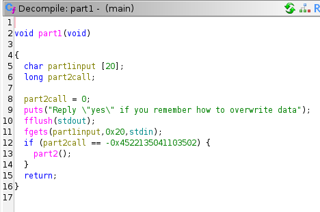
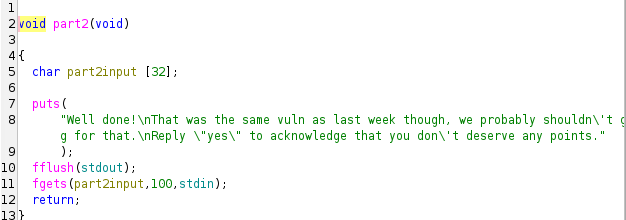
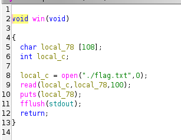

# ret2win

**Platform:** DAMSEC  
**Category:** pwn  
**Difficulty:** 150 (1 flag)  
**Date Completed:** 2025-10-27  

---

## 1. Summary
2-part pwn challenge revolving exploiting memory & buffer overflows

## 2. Methodology
Part 1:
- Decompiling the code in Ghidra, the first meaninful function that gets called is a part1() function  
  
- Looking at the function, there is an input that gets put into a function, and an if statement that checks if a separate variable is a certain value before calling part2(). I renamed these variables in Ghidra for convenience
- We can not write into the part2call through any of the intended functions, so we need to write this through an exploit
- In our case, we can use a memory overflow exploit, since the input only expects 2 characters
- The check value for pat2call is `-0x4522135041103502`. The compiler stores this as a signed 64-bit integer, but we need to convert this to the unsigned representation
- Converting with any online tool or Python's hex() function, we get the value `0xbaddecafbeefcafe`
- With this information, we can craft a script using the Python pwntools library to make a payload for part 1:
```python
from pwn import *
payload1 = b'A' * 20 # Fill  up part1input
payload1 += p64(0xbaddecafbeefcafe) # Add part2call value converted from int
```

Part 2:
- The part2 function also takes an input, but nothing is done with it  
  
- There is also no function in here to call the next one, so we need to find another way to get to the win() function that prints the flag  
  
- If we can overwrite all of the local variables in this function (only 1 in this case) and the saved RBP, we can change the return address to run any function we want
- In this case, we only have 32 characters to overwrite, plus an additional 8 bytes for the RBP
- In Ghidra, we can find the address for the win() function easily, and add this to the payload
- Using pwntools, we can make one more payload to get the flag
```python
payload2 = b'B' * 40 # Fill buffer + saved RBP (32 + 8)
payload2 += p64(0x400687) # Overwrite return address to win function
```

## 3. Commands & Tools Used
`Ghidra`: Reverse engineering tool so I don't have to read assembly  
`pwntools`: Python library with many uses, in this case used to create payloads that couldn't be typed normally

## 4. Lessons Learned
I learned a lot about how the stack frame is set up, and how to exploit memory overflows to change values within the frame itself. I also reinforced my general memory overflow knowledge from last week, and worked a bit with pwntools, which I can see myself using again in the future.
