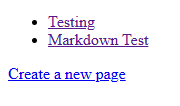
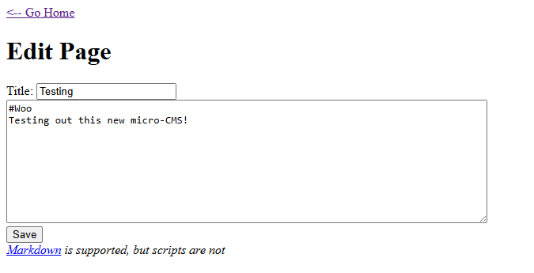
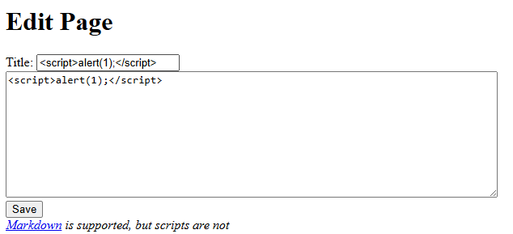
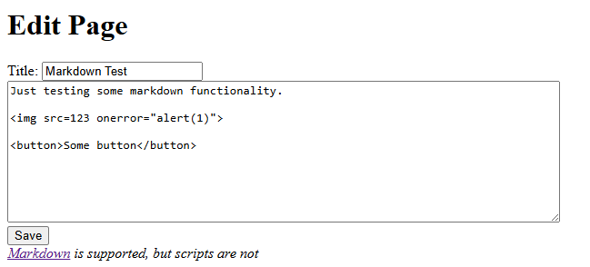

# Micro-CMS v1

**Platform:** Hacker101 CTF  
**Category:** Web  
**Difficulty:** Easy  
**Date Completed:** 2025-08-30  

---

## 1. Summary
Exploiting common web vulnerabilities on a broken down CMS

## 2. Methodology
Information Gathering:
- By default, there are only 3 links on the homepage.  
  
- The default pages are `/page/1`, `/page/2`, and `/page/create`.
- Each page has an edit option.  
  
- When editing a page, the directory changes to `/page/edit/(page #)`.

Experimenting:
- After making a new page, I noticed that the directory is `/page/11`. This is odd, because this should only be the third page.
- If I manually input page numbers, pages 3-10 all give the 404 "Not Found" error, except for page 3, which shows "Forbidden".
- Thinking about the edit directory, I tried typing in the URL `/page/edit/4`, and this actually showed the first flag.
- The edit page shows the message `Markdown is supported, but scripts are not`. Of course I'm not gonna take their word for it, so I decided to try some XSS by inputting a script tag.
  
- The alerts don't run, and looking at the source code I see the `<scrubbed>` tag where I tried to put the script, meaning the input is sanitized.
- I decided to go back to the homepage to look for other methods, when an alert showed up on my screen. Apparently, the XSS does work, but only on the homepage where the title of each article is displayed. With this, I accidentally ran into my second flag.
- Going back to the URLs, I decided to test if SQLi injection was possible
- I typed in the directory `/page/1'`, and recieved the 404 error. This is good news, because it means the single quote was not ignored and there is most likely potential for SQL Injection somewhere. 
- I tried various payloads to try to get SQLi on this directory, but I wasn't finding anything. That's when I remembered that there are other directories I could be looking at.
- From the edit page, I tried `/page/edit/1'`, and found my third flag just from that.
- At this point I was stuck for a while trying to find the fourth flag, and I kept going back to the edit form.
- I noticed an image that failed to load on page 2, and remembered an XSS payload involving an `onerror` event that bypasses some filters.
- I replaced the markup image format with an `` HTML tag, and put an onerror function. 
  
- After saving this, the alert did show up, meaning I was able to get XSS on the page. However, there was no flag for me. 
- After some messing around, I decided to look at the source code to see how my payload was handled, and the final flag was hidden in the img tag that I used for the payload.

## 3. Commands & Tools Used
`<alert>`: used for proof of concept that there is an XSS vulnerability. If I can run an alert on the page, I can run whatever JS code I want.  
`'`: putting a single apostrophe (') or quote (") after something that may be an SQL query could give an error that would allow you to discover more about the database and lead to more harmful SQL injection.  
`<onerror>`: if `<script>` tags are filtered from input, it may be possible to bypass with another tag that can load scripts using events. For example, images have onload and onerror events, buttons have onclick events, etc.

## 4. Lessons Learned
This CTF just involved a lot of experimenting and a lot of trial and error. None of the concepts were very complicated, but there were a few times where I was lost and didn't know what to do, and just trying random things led me to a flag. I think this represents real-world vulnerabilities, where you may have to run through a lot of trial and error attempts before you find a vulnerability, and the vulnerability may be found in a place you would've never thought to look. This CTF taught me how to think outside of the box and to never overlook anything when searching for vulnerabilities.
