# Lookup

**Platform:** [TryHackMe](https://tryhackme.com)  
**Category:** Web & Privilege Esclation  
**Difficulty:** Easy  
**Date Completed:** 2025-08-28

---

## 1. Summary
Lookup showcases various real-world vulnerabilities, from web application weaknesses to privilege escalation techniques.

## 2. Methodology
Given information:
- IP Address

Scanning:
- We aren't given much information, so I'll start with a port scan
- Nmap shows 2 open ports, running HTTP and SSH.
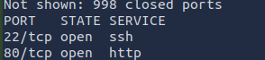

Webpage:
- After adding the IP address to /etc/hosts, the website shows a login form.
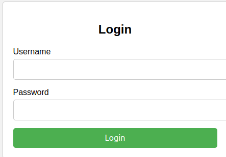
- When inputting random credentials, the website shows `Wrong username or password. Please try again.`, and redirects to the original login page after 3 seconds.
- Looking at the network tab, I can see a POST request to /login.php. I'll write this URL down in case I need it later.
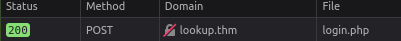
- While testing random credentials, I noticed that when using the 'admin' username, the web server gives a slightly different response. Instead of `Wrong username or password`, the page only shows `Wrong password`. We can use this response to generate a list of valid usernames.

Finding usernames:
- Using ffuf, I can fuzz the login form to look for usernames that give the response we're looking for.
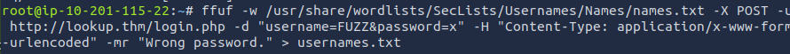
- Now, looking at the output, I see 2 valid usernames: admin and jose.

Finding the password:
- To find the password, I can try almost the exact same command, but fuzz the password instead of the username.
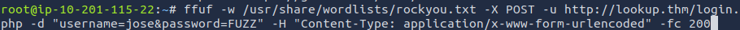
- This command gives 1 password that matches.

New page:
- Logging in as the user and password that we found earlier, the page redirects to a new subdomain: `files.lookup.thm`
- Adding this to my hosts file and refreshing, the page shows a bunch of text documents, with each one showing what appears to be credentials.
- There is no way of knowing which credentials are correct or where they're used, so I decided to look around the page more.
- The web file manager has an about page that shows the software and version, elFinder version 2.1.47
- Searching in Metasploit, I found a command injection exploit that seems to work with this software.
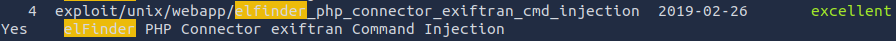
- Setting the remote host and running the exploit, we get a shell as www-data!
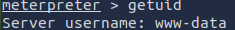

Privilege Escalation:
- To get a more stable shell first, I used pty
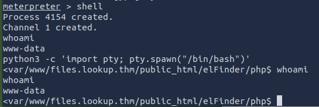
- looking at /etc/passwd, I find an interesting user 'think'.
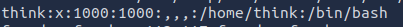
- In this user's home directory, there is a 'user.txt' file that we don't currently have access to.
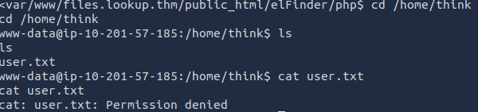
- Running `find / -perm /4000 2>/dev/null`, I see an odd binary in /usr/sbin/pwm, which is owned by root.
- Running the binary, it seems to be running 'id' command, extracting a username and UID, and tries to put that data into a .passwords file to do something with it.
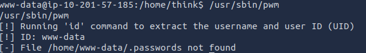
- I think we can use this binary to execute an 'id' command that extracts the information from the "think" user instead.
- I made a file in /tmp/id with the following:
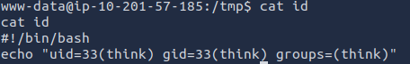
- Running the binary again, I get a list of passwords
- Putting this password list onto my machine and running hydra, I can brute force the password for the think user, and it gives a valid login
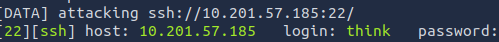

Privilege Escalation Part 2:
- The SSH login found earlier does work to SSH as think
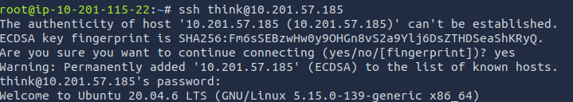
- We are put into the think users home directory, which contains the first flag!
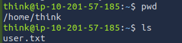
- Viewing this users permissions, we see unrestricted access to the 'look' command. We can exploit this to read files, so I chose to get the SSH private key
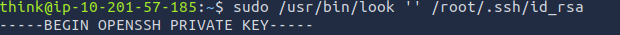
- Adding this key to my machine, I can use it to SSH as root.
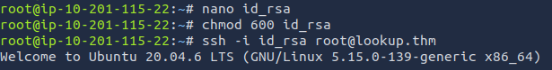
- The second and final flag is located in the home directory of the root user!

## 3. Commands & Tools Used
- Nmap: As always, nmap is one of the very first tools I use to check for open ports. Especially helpful in scenarios like this where we're given little to no information.
- Ffuf: Very useful for fuzzing both usernames and passwords in a login form like this one.
- Metasploit: Amazing for finding and exploiting vulnerabilities in software and services.
- `python -c "import pty; pty.spawn('/bin/bash')"`: used for upgrading the shell.
- `find / -perm /4000 2>/dev/null`: Used to find files with 4000 permission, the 2>/dev/null section ignores errors to have a readable output.
- Hydra: Versatile and simple tool for bruteforcing, works very well with a short wordlist like the one given in the room.
- `sudo /usr/bin/look '' /root/.ssh/id_rsa`: The look command is typically used to find lines that start with a certain string. If we supply it with an empty string, it will simply display the whole file, making it a dangerous command to give a user access to.
- chmod: used a few times throughout the room to change permission of a file, OpenSSH won't allow you to use an id_rsa file that other uses can read or write to. +X argument gives executable permissions, needed for writing scripts like the bash script.

## 4. Lessons Learned
This room was much harder than previous rooms for me, especially the privilege escalation portions. I didn't have much experience with privilege escalation before this, so it was very interesting to try to figure this one out. I think that privilege escalation is a huge topic, so I'm sure I have just barely scratched the surface, but this room gave me a good starting point to understand how it works in general.

