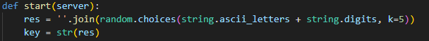
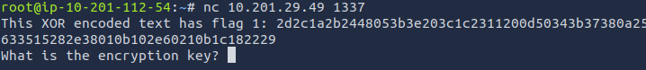
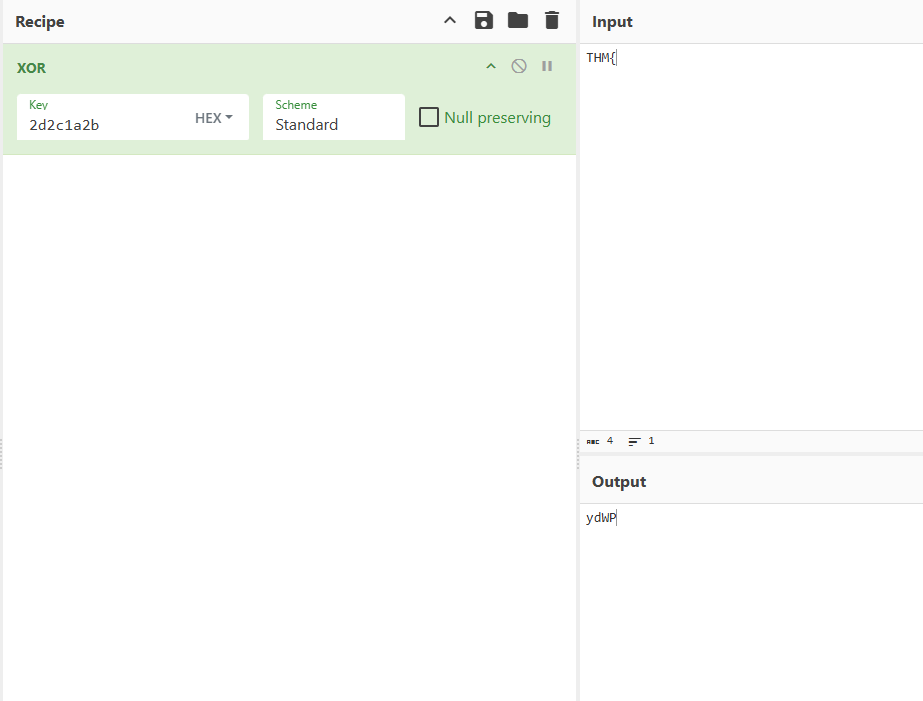
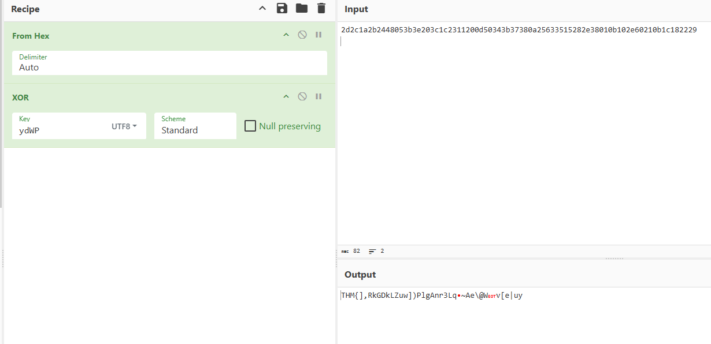

# W1seGuy

**Platform:** [TryHackMe](https://tryhackme.com)  
**Category:** Cryptography  
**Difficulty:** Easy  
**Date Completed:** 2025-08-26

---

## 1. Summary
XOR decoding with an unknown key

## 2. Methodology
Initial given information:
- Source code showing the encoding process
- IP Address and listening port
- Based on the Python code given in the task files, the key is 5 randomly generated characters.

Connecting to the target:
- Using Netcat, the response gives us an encoded flag and prompt asking for the encryption key.

- Notice that the encoded flag is also in hex format
Finding the key:
- I know that most flags in THM rooms follow the format "THM{flag}"
- Because of this, the first 4 hex bytes will correlate to the string "THM{"
- Putting the substring into CyberChef, I can use the first 4 bytes of the hex string as the key in an XOR operation. The output of this will give a 4 character output, 1 character less than the key we need.

- To brute force the final character, I made a new recipe that turns the hex string into normal text, and then puts it through an XOR operation with the partial key found earlier. We can see in the output that the first part of the flag ("THM{") is showing up as it should.

- From this point, I just tried adding letters after the partial key until I found something that looked like a flag, with the main indicator being the ending curly brace '}'.

The final flag:
- Inputting my key into the Netcat connection from earlier, it gives me the final flag in plaintext, so there is no more work to do!

## 3. Commands & Tools Used
- Netcat: Probably the simplest way to transfer data in rooms like this.
- CyberChef: The swiss army knife for encoding/encryption, very fast and easy to use. Great for experimenting with different keys and methods like I did in this room.

## 4. Lessons Learned
Before this room, I knew the theory behind cryptography, but didnt have much hands-on experience. I am know much more comfortable working with CyberChef, and I would probably be able to complete a similar room in less than half the time it took for this one.

